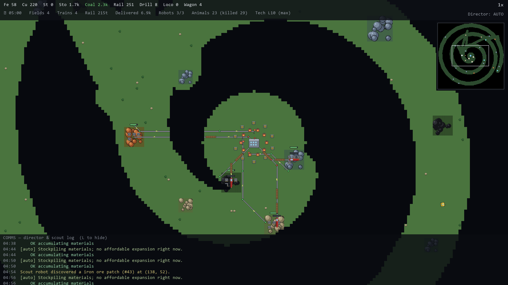

# AutoFactorio

A top-down, **autonomous logistics game** inspired by Factorio's train network — pared down to the part that's the most fun to watch run itself: **mine ore → haul it home by train → factories consume it to build more track, more mines, and more trains → the network expands itself across the map.**

You don't place belts or fight biters. You watch an **LLM "logistics director"** grow a self-expanding rail empire while an **automated scout** drives outward from base, peeling back the fog of war to find the next ore patch.

> Independent fan project, not affiliated with Wube Software. All art is procedurally generated and public-domain (CC0) — see `LICENSE`.



---

## The core loop

1. **Mining fields** sit on ore patches and auto-mine into a local buffer.
2. **Trains** run one-way loops: out to a field's *load* station, back to a home *unload* station.
3. **Factories** at home consume raw ore (smelted into plates/steel) to craft the things that let you grow: **rails, mining drills, locomotives, cargo wagons, train stops, signals.**
4. The **LLM director** looks at a compact report each turn and decides *what to build next* — expand to a newly-scouted patch, add a train, lay track, build another factory.
5. A deterministic **rail autopilot** turns those high-level decisions into actual collision-free track: every line is **one-way (directed)**, so trains structurally never meet head-on.
6. The **scout bot** keeps exploring outward, revealing new patches for the director to claim.

If the LLM gateway is unreachable, a built-in **heuristic director** keeps the game running (`--fallback`).

## One-way tracks (no collisions, by design)

Real Factorio prevents collisions with **rail signals** and **chain signals** that carve the network into mutually-exclusive *blocks*. AutoFactorio borrows the idea but simplifies it: the rail network is a **directed graph**. Track is laid as one-way segments, junctions merge/split flow, and a lightweight **block-reservation** layer stops two trains entering the same segment. The result is the Factorio outcome (no head-on crashes, no deadlocks) without you ever placing a signal.

## Controls

| Input | Action |
|-------|--------|
| **Mouse wheel** | Zoom in / out, centered on the cursor |
| **Right-drag** / **WASD** / **arrows** | Pan the camera |
| **Click minimap** | Jump the camera to that spot |
| **M** | Toggle the minimap |
| **F** | Follow the scout bot |
| **Space** | Pause / resume the simulation |
| **`+` / `-`** | Game speed up / down |
| **I** | Toggle the detail / inventory panel |
| **L** | Toggle the LLM communications console |
| **F5 / F9** | Quicksave / quickload (`saves/quicksave.json`) |
| **N** | Force a director decision now |
| **Esc** | Quit |

## Running it

**Windows (easiest):** double-click **`play.bat`**. On first run it creates the `.venv`, installs `pygame-ce` + `numpy`, then launches the game.

**Manually:**
```sh
py -3.14 -m venv .venv
.venv\Scripts\python -m pip install -r requirements.txt
.venv\Scripts\python run.py
```

Useful flags:
- `--fallback` — run the heuristic director, never call the LLM
- `--seed N` — fixed world seed
- `--config path.json` — use a specific config file
- `--load saves/quicksave.json` — resume a saved game

## The LLM director

The director talks to an **OpenAI-compatible** endpoint (your LAN's *Golden Eye* gateway). To point it at a different server or model, set the **location (`url`)** and **`model`** in either of two places:

**`config.json`** — copy `config.example.json` to `config.json` (gitignored) and edit:

```json
{ "llm": { "url": "http://192.168.15.3:21345", "model": "qwen3:4b", "enabled": true } }
```

**Environment variables** (handy for a one-off, and they win over `config.json`):

```sh
AUTOFACTORIO_LLM_URL=http://10.0.0.5:11434  AUTOFACTORIO_MODEL=llama3.1:8b  .venv\Scripts\python run.py
```

Built-in defaults live in `autofactorio/config.py`. To run fully offline with no endpoint at all, use `--fallback` (or set `"enabled": false`).

Each decision turn the game sends a compact JSON report (inventory, stations, idle trains, newly-discovered patches) and the model replies with a validated list of build actions. Thinking is disabled and replies are forced to JSON, matching the SimCity_LLM game-AI setup. The call runs on a worker thread so the game never stalls while the model thinks; if the gateway is unreachable it logs the error and falls back to the heuristic director for that turn. Run with `--fallback` for instant, fully-offline decisions.

## Project layout

```
run.py                  entry point
play.bat                Windows launcher (forces the venv interpreter)
assets/generate_assets.py   procedural CC0 sprite generation (runs on first launch)
autofactorio/
  balance.py            all tuned game numbers (recipes, rates, starting inventory)
  config.py             endpoint/display config (config.json + env overrides)
  engine/               world+fog, mining, rail graph, trains, economy, scout, simulation, persistence
  ai/                   LLM client, worker-thread director, report, action schema, apply, fallback
  ui/                   camera, renderer, HUD, comms console, minimap, main app loop
tests/                  pytest suite + headless smoke scripts + screenshot tool
docs/ARCHITECTURE.md    design notes
```

## Features

- Self-expanding economy: mine → one-way train haul → smelt → craft → expand.
- **Tech research**: the factory makes science from surplus; the director researches
  levels that compound the economy (drill output, train speed, wagon capacity,
  smelting speed, rail cost, +explorer robots up to 3).
- LLM director (Golden Eye) with an instant heuristic fallback.
- Collision-free one-way directed rail (two parallel lanes + one-train-per-block mutex).
- **Robots (up to 3)** are the base's hands: they **build new fields** (drive out and
  lay the planned/ghosted track + drills before the train runs), **tear down depleted
  fields** and haul the rail/drills home for reuse, **repair damaged trains**, hunt
  wildlife, gather emergency fuel as a slow last resort, and explore. Tasks are
  prioritized; robots self-repair out of combat.
- **Wildlife**: herds spawn in the fog and wander; trains crush animals (taking
  damage); animals retaliate only when the base can replace the robot they'd kill.
- Finite ore patches; depleted fields are auto-retired and their trains salvaged.
- Progressive fog of war revealed by an autonomous scout.
- Procedurally-generated CC0 art; trees/rocks scenery.
- Camera pan/zoom, **minimap** (click to jump), click-to-select/follow trains & fields.
- Save / load (F5 / F9 or `--load`).
- pytest suite covering the loop, self-expansion, depletion lifecycle, block-mutex, and save/load.

See `docs/ARCHITECTURE.md` for the design and git history for progress.
